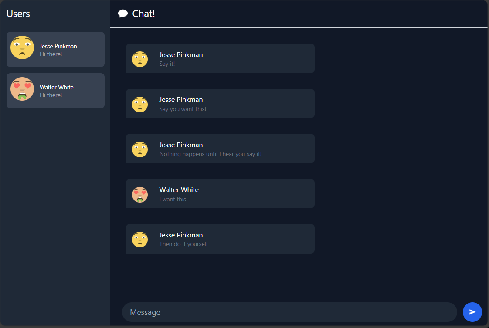

# Tutorial 10 - Reflection
> Tegar Wahyu Khisbulloh (2206082032) - Pemrograman Lanjut A

## 3.1: Original code

## 3.2: Be Creative

Pada gambar di atas saya mengubah tema warna menjadi dark theme dan menambahkan avatar icon.